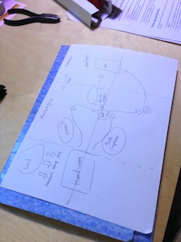
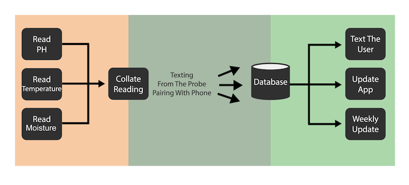
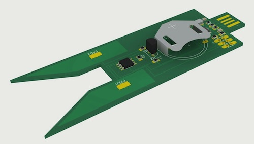
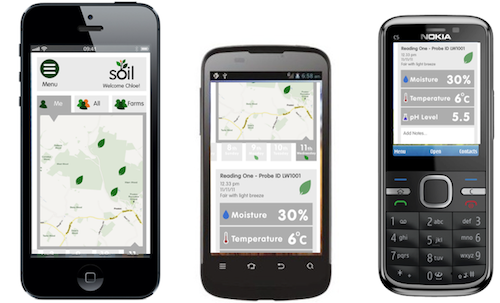
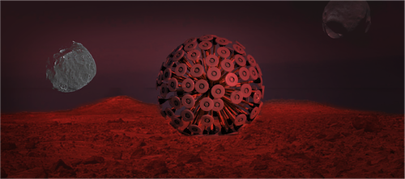
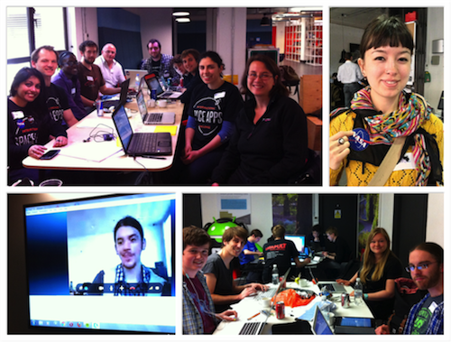

# People of the Soil

During the Space Apps Challenge 2013, at the Google Campus in London, we have developed **Soil**: an extremely cheap and easy to use system to collect and manage soil data.

We kept in mind that not all the world is as lucky as us and there are plenty of places where internet is slow or completely absent and where there is much less money around. With **Soil** we created an open system that includes:

- an extremely cheap (~3£) digital soil testing kit to collect data, and eventually send it
- a light protocol to send the data using web, apps or even SMS and collect it on a centralised database
- an API to disseminate information via SMS or web
- a wonderful and light web application that can run on old and recent phones and gives access to the data with a simple and nice interface.

# Project Soil

We spent the first part of the challeng looking at all our different backgrounds and skills and reformulating the challenge in a series of smaller ones that we feelt we could face. 

As you can see from the image below, **Soil** is made by three big interlaced projects, each of them with a particular focus: acquiring data, collecting it and make it available.

## The probe

The hardware team realized in an amazingly short time a working prototype of probe to collect Soil data. In the first version an Arduino was collecting data from various sensors and sending it to a Rasperry Pi programmed to forward it to our database.

From that prototype they engineered a small and cheap device that you can simply plug in the field and leave alone collecting the data. Afterward it is enough to have a USB connection to collect the data and send it to our servers.

## The SMS service

Keeping in mind that not all the world is covered by internet, we used the twilio API to create a service to send the data directly through SMS. Moreover, when enough data is available, the SMS service is able to answer to suggest what it is better to plant and when, and answer to other simple questions.

## Data collection

While the SMS data goes directly to the database, all the rest of the communication is made by means of [MQTT](http://mqtt.org), a machine-to-machine (M2M)/"Internet of Things" connectivity protocol designed to be extremely lightweight. In this way we can move all the management of the data to our server and consume as less power and bandwith as possible on the clients.

## Web App

Again keeping in mind to consume as less bandwith as possible, we designed and developed an extremely intuitive and nice application, completely based on HTML and CSS, and with nearly no image. In this way people can access the data using any device, not just the last generation of smartphones, consuming nearly no bandwidth!

You can already test our web app going to [Soil App](http://www.soil-app.appspot.com/)

## Ideas for the future
The possible implications and improvement for the future are the most variuos. Here there is a small list of what we could and would like to achieve:

- Improve the probe to make it cheaper, stronger and with longer battery life
- Add wifi/bluetooth/NFC capability to a bigger version of the probe that would not require laptop, smartphones or raspberry pi to send the data
- Create an easy to use application to collect and send the data from probes that cannot be connected to wifi or bluetooth networks
- Make the system independent from us and working on a global scale
- Add some finer controls on the database to avoid fake data
- Add ability to interact with grower nations API
- Implement a flexible API to make the soil data available to researchers and any other in need
- Create a complete database of fruit and vegetables and the soil/weather characteristic needed to grow them. In this way we can give precise information of what is best to plant in a certain soil based on the collected data
- Improve the Web App to include data analysis, comparisons and infographics
- Go to other planet (see below)

## Project Soil on other Planets
And with our small collaboration with solsola we are ready to fly on the space and collect extra terrestrial soil data!

# More Images and Informations

Look what we did going to the [Git Hub page](https://github.com/mseri/pplofthesoil), looking for our [hashtag #pplofthesoil](http://bit.ly/124FU89) on Twitter, watching our [presentation](http://bit.ly/ZIbJ3x) or reading our ["storified" weekend story](http://bit.ly/17dYVqT)

Additionally you can read:    
- [Soil Testing Kit Challenge](http://spaceappschallenge.org/challenge/soil-testing-kit)
- [People of the Soil -- Project Page](http://spaceappschallenge.org/project/people-of-the-soil/)

* * * * * * * 

The Git repository contains:

- The **presentation** of our work: *SOILPres-v3.pdf*
- The full implementation of the **probe** (hardware and software) and the **PCB** schematic to build a cheap and effective probe: *probe* folder
- The interface to the **MQTT** service that translates the data and sends it to the DB: *MQTTinterface* folder
- The **DB and SMS** service (hosted on another Git repo): *text-message-and-database-api* folder
- The **mobile app** to have access to the data: *mobileapp* folder
- A folder **img** with the pictures used in this README files

The project is released under Eclipse Public License 1.0

* * * * * * * * * *    
* * * * * * * * * *    

# Something more technical for us and potential collaborators

## Data structure

Data readings are of the form  

{  
    "id": "182791",  
    "time": "13:56:13 20/04/2013",  
    "lat": "97.03125",  
    "long": "107.2890",  
    "hasAltitude":true,  
    "altitude": "10",  
    "hasPH":true,  
    "pH":"7",  
    "hasMoisture":true,  
    "moisture":"97",  
    "hasTemperature":true,  
    "temperature":"40"  
}  

and must be sent to
- MQTT Broker: m2m.eclipse.org:1833
- Topic: /pots/soil

id, time, lat, long MUST be present and not NULL, otherwise the data is sent directly to /dev/null

It can be done as simple and boring as using <http://mqtt.io/>    
Or you can let your hardware prepare the data and send it using (more or less) any programming language: <http://mqtt.org/software>

